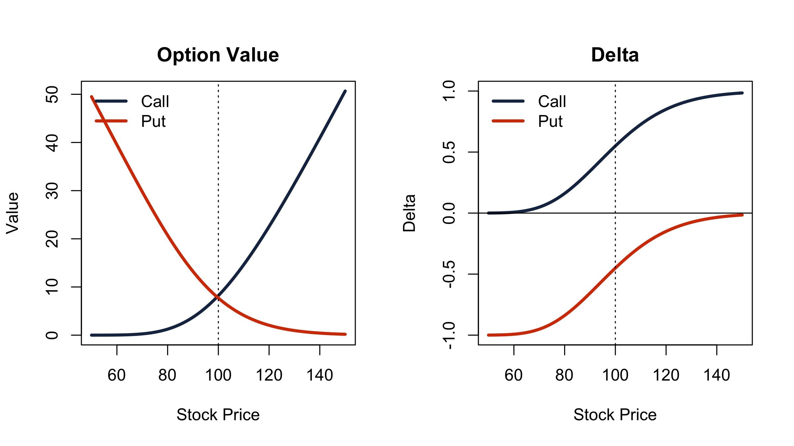
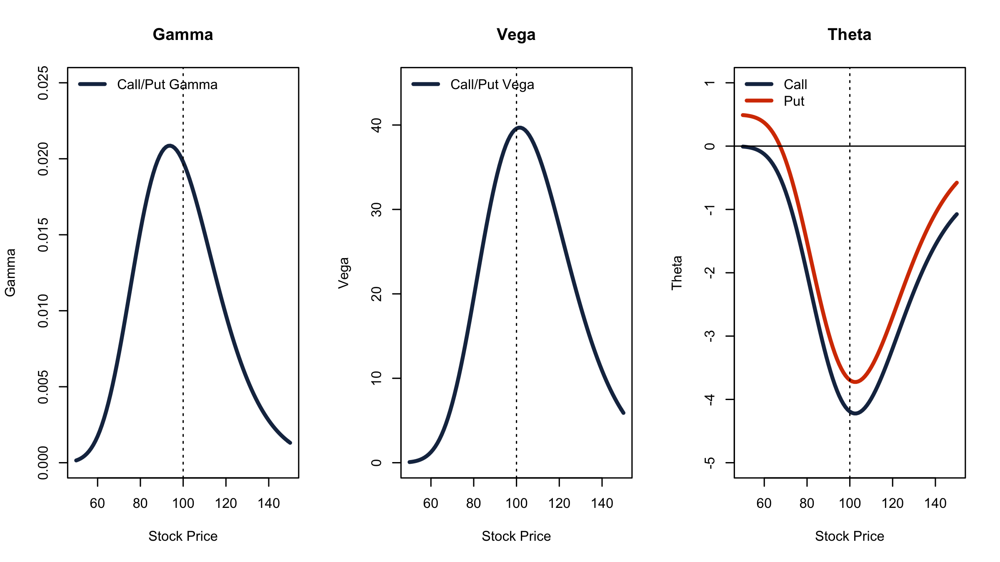

Black-Scholes Model (A Shiny Application)
========================================================
author: Kiril D. Sakaliyski
date: February 28, 2016

Main Idea
========================================================

This application displays call/put option prices and parameter sensitivities using the Black-Scholes method.

The input parameters are:
- $K$ is the strike price
- $\sigma$ is the standard diviation (or volatility)
- $\tau$ is the time from now until expiration, expressed in days
- $r_f$ is the risk-free interest rate

Main Idea (contd.)
========================================================

- "The Greeks" (Delta, Gamma, Vega and Theta) measure the sensitivity of the value of a derivative to changes in parameter value(s) while holding the other parameters fixed. They are partial derivatives of the price with respect to the parameter values. 

- The application displays call/put option prices and greeks as a functon of $S$, the current stock price using the Black-Scholes method. By changing the various input parameters, one can see how the option value and greeks change.

- In the next slides an option with fixed strike price $K=100$, volatilty $\sigma=20%$, $\tau=1$ year to maturity and risk-free rate of $r=0.5%$ is observed. These are also the initial application parameters.

Option Price and Delta
========================================================

Plots of the option price and delta as functions of the current stock price.

Gamma, Vega and Theta
========================================================
Plots of the option gamma, vega and theta as functions of the current stock price.

